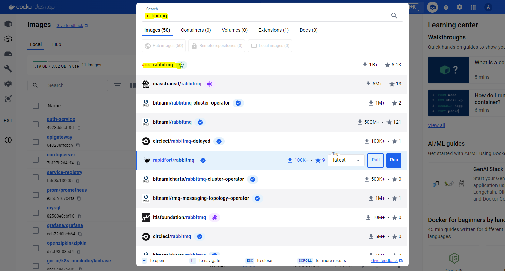
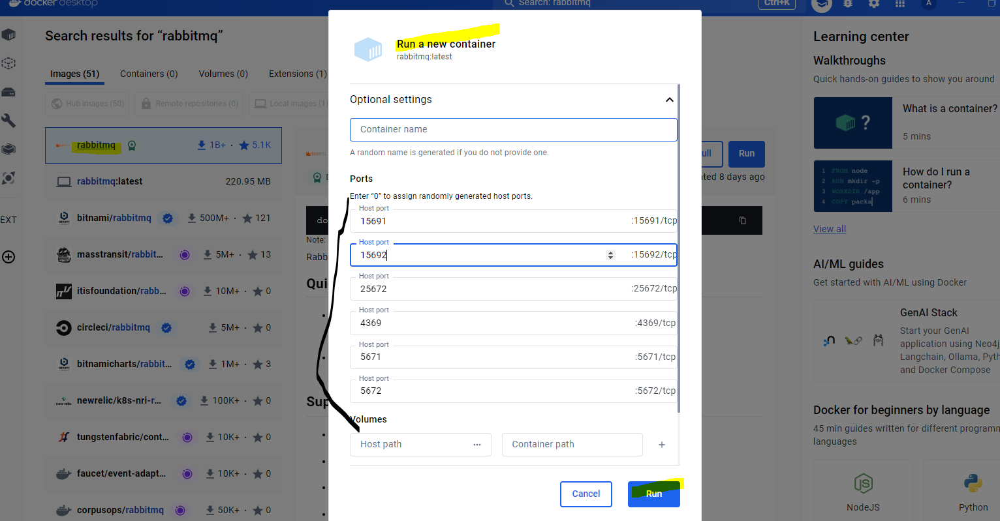
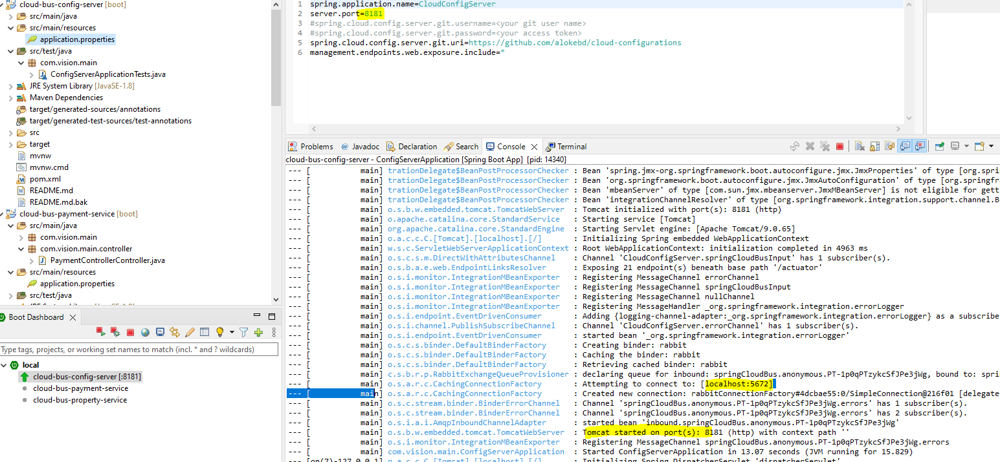

## Spring Boot Cloud Config server with RefreshAuto Spring Boot services
- Dependencies:
- Spring Boot (2.7.4)
- Maven 
- Java (1.8) 
- Spring Actuator
- Bus (spring-cloud-starter-bus-amqp)
- RabbitMq 
- GIT access (for application properties)

## About Spring Cloud Bus
- https://spring.io/projects/spring-cloud-bus
- https://cloud.spring.io/spring-cloud-bus/reference/html/

## Configure RabbitMQ
- this demo, Desktp version is used for rabbitmq as below:
```
spring:
  rabbitmq:
    host: localhost
    port: 5672
    username: user
    password: secret
```
-
-
## Run Config Manager & Check RabbitMq (Bus)
-


# Config Manager API
- Push To All Bus (POST): http://localhost:8181/actuator/busrefresh
- Check Config (POST): http://localhost:8181/actuator/refresh

